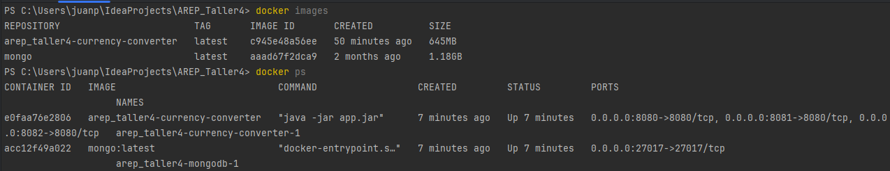
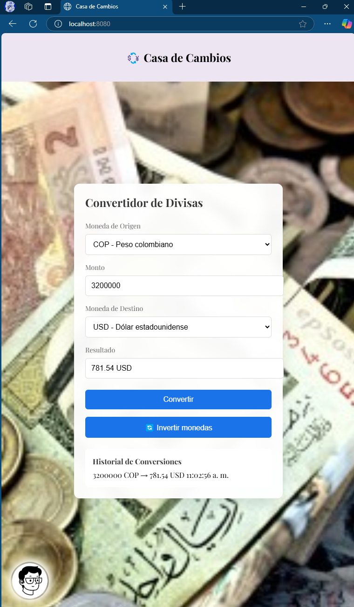
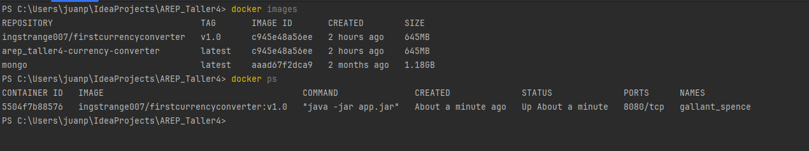
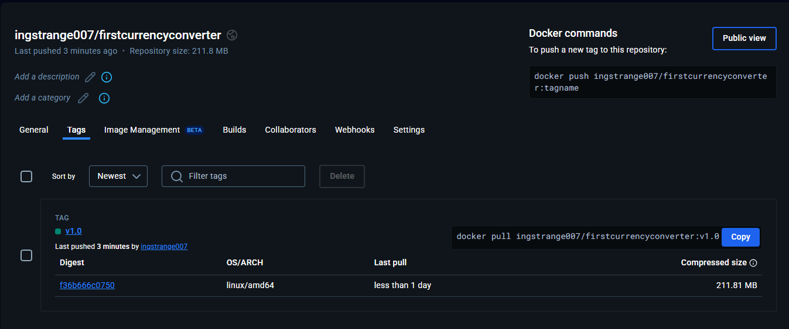

# Currency Converter - Taller 4 AREP

## 📌 Descripción General

Currency Converter es una aplicación web que permite realizar conversiones de divisas en tiempo real utilizando una API externa. El proyecto implementa un framework HTTP personalizado y ofrece una interfaz web intuitiva para convertir entre múltiples monedas.

## 🔍 Arquitectura del Sistema

La aplicación sigue una arquitectura de microservicios con los siguientes componentes principales:

### 🔨 Componentes

- 👀 **Frontend**: Interfaz web desarrollada con HTML, CSS y JavaScript

- 💀 **Backend**: Servidor HTTP personalizado en Java

- 💰 **Servicio de Conversión**: Integración con Exchange Rate API

- 🛒 **Base de Datos**: MongoDB (opcional, preparado para futuras extensiones)

### 🗿 Diagrama de Arquitectura

## ✖️ Diseño de Clases

### Paquete Model

- `Currency`: Enum que define las divisas soportadas.
- `Conversiones`: Record para manejar detalles de conversión.
- `ConversionRequest`: Record para validar solicitudes de conversión.

### Paquete Service

- `ConsultaConvertidor`: Gestiona consultas a la API externa.
- `CacheService`: Implementa caché para optimizar consultas.
- `ConversionService`: Coordina el proceso de conversión.

### Paquete Framework

- `HttpServer`: Servidor HTTP personalizado.
- `RequestHandler`: Maneja solicitudes individuales.
- `StaticFileHandler`: Sirve archivos estáticos.

## 🖥️ Tecnologías Utilizadas

- Java 17
- Maven
- Docker
- Docker Compose
- Exchange Rate API
- HTML5
- CSS (Tailwind)
- JavaScript

## 🧷 Requisitos Previos

- Java 17
- Maven
- Docker
- Docker Compose

### 🔝 Opcionalmente, si se desea desplegar en AWS

- AWS CLI 2.2.0 o superior (opcional): Para interactuar con los servicios de Amazon Web Services desde la línea de comandos.

## 🎬 Instalación 

1. **Clonar el repositorio** desde GitHub:

```git clone https://github.com/JuanPabl07DP/AREP_Taller4.git```

2. Navegar hasta el directorio del proyecto:

```cd AREP_Taller4```

3. Ejecutar el archivo **docker-compose.yml**:

```docker-compose up -d```



## 🚀 Uso

1. Abrir http://localhost:8080 o http://localhost:8081 o http://localhost:8082


2. Seleccionar moneda de origen 


3. Ingresar monto 


4. Seleccionar moneda de destino 
5. Hacer clic en "Convertir"



## 🔜 Arquitectura desplegada en Docker





Ahora puedes descargar y ejecutar la imagen con:

```docker pull ingstrange007/firstcurrencyconverter:v1.0```

```docker run -p 8080:8080 ingstrange007/firstcurrencyconverter:v1.0```


## 🔝 Cliente desplegado en AWS


Video del despliegue:

([Video_DespliegueAWS](./img/))

## 📌 Autor

- Juan Pablo Daza Pereira ([JuanPabl07DP](https://github.com/JuanPabl07DP))

## 📅 **Fecha de creación: Febrero 2025**

